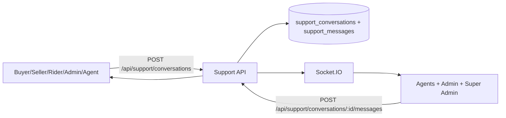
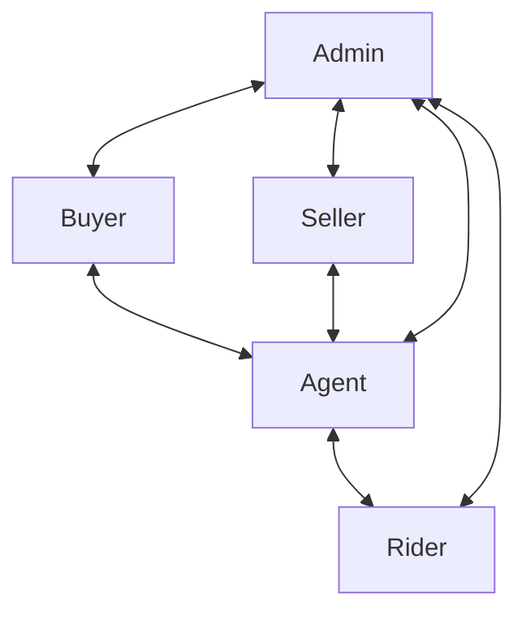
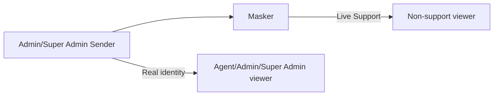

# Phase 2: Messaging & Communication System Rebuild

Last updated: February 21, 2026

## Scope Summary

- Real-time support/chat updates with Socket.IO (no static messages).
- Persistent support and direct chat messages in PostgreSQL tables.
- Role-aware support routing across buyer/seller/rider/agent/admin/super_admin.
- Identity masking for `admin` and `super_admin` in customer-facing support conversations.
- Read/unread support message tracking and support analytics endpoint.

## Non-Breaking Upgrade Strategy

| Component | Current Tool | Keep | Upgrade | Reason |
|---|---|---:|---:|---|
| Database | PostgreSQL + Drizzle | Yes | No | Stable ACID store, supports concurrent reads/writes |
| Direct Chat | `chat_messages` + Socket.IO | Yes | No | Already real-time and persistent |
| Support Chat | `support_conversations` + `support_messages` + Socket.IO | Yes | Additive | Added read/analytics columns and masking logic only |
| Maps/Tracking | Leaflet + tracking endpoints | Yes | Optional | Upgrade only if live GPS smoothing/latency becomes an issue |
| Analytics | Existing admin stats + new support analytics route | Yes | Additive | Added support response KPIs without replacing existing dashboards |

## Messaging Flow Diagrams

### 1) Customer Support Entry (all user roles)

### 2) Role Support Paths

### 3) Identity Masking Path

## Data Model (Support Chat)

### `support_conversations`

- `id`
- `customer_id`
- `agent_id`
- `status` (`open` | `assigned` | `resolved`)
- `subject`
- `last_message`
- `first_response_at` (new)
- `resolved_at` (new)
- `created_at`
- `updated_at`

### `support_messages`

- `id`
- `conversation_id`
- `sender_id`
- `message`
- `is_read` (new)
- `read_at` (new)
- `created_at`

## API Additions/Changes (Phase 2)

- Existing support endpoints remain unchanged in path/contract and are backward-compatible.
- `GET /api/support/conversations`
  - Adds unread counts and response lifecycle fields.
  - Applies masked sender identity for non-support viewers where sender role is `admin`/`super_admin`.
- `GET /api/support/conversations/:id/messages`
  - Returns support message read fields.
  - Marks inbound unread messages as read.
  - Emits `support_conversation_updated` with `event: "read"`.
- `POST /api/support/conversations/:id/messages`
  - Tracks first support response time (`first_response_at`) when first support-staff reply is sent.
  - Customer notification sender name is masked when sender is `admin`/`super_admin`.
- New: `GET /api/support/analytics`
  - `totals` (`open`, `assigned`, `resolved`, `unresolved`)
  - `responseTime.avgFirstResponseSeconds`
  - `unresolvedBacklog.over30MinutesWithoutFirstResponse`

## Permission Matrix (Messaging/Support)

Managed by Super Admin role-feature controls:

- `messages.view`
- `messages.send`
- `support.view`
- `support.manage`
- Seller/Rider chat menu visibility is bound to `messages.view` in dashboard navigation.

Default baseline now includes support access for all primary non-super roles:

- buyer: `support.view`, `support.manage`
- seller: `support.view`, `support.manage`
- rider: `support.view`, `support.manage`
- agent: `support.view`, `support.manage`
- admin: `support.view`, `support.manage`

Super admin can disable any role’s support permissions from `/admin/permissions`.

## Analytics Definitions

- **First response time**: `support_conversations.first_response_at - created_at`.
- **Unresolved chats**: support conversations where `status != 'resolved'`.
- **Backlog risk (30m SLA)**: unresolved conversations with `first_response_at IS NULL` older than 30 minutes.

## Migration

`migrations/0017_support_messaging_phase2.sql` adds:

- `support_messages.is_read`, `support_messages.read_at`
- `support_conversations.first_response_at`, `support_conversations.resolved_at`
- Read/status indexes for support query patterns
