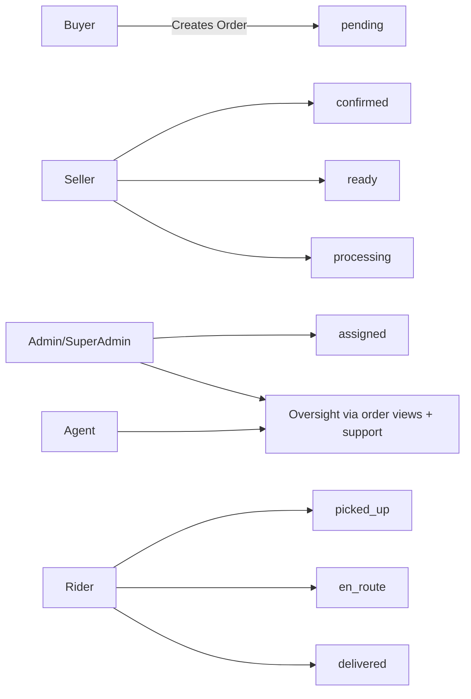

# Phase 2: Order Flow, Tracking & Status Synchronization

Last updated: February 21, 2026

## Canonical Order Flow

`pending -> confirmed -> ready -> processing -> assigned -> picked_up -> en_route -> delivered`

Side paths:

- `pending|confirmed|ready|processing|assigned -> cancelled`
- `processing|delivered -> disputed`
- `disputed -> delivered|cancelled` (admin/super_admin with reason)

Rules:

- Status changes are backend-only via `applyOrderStatusTransition`.
- Each transition writes `order_status_history` with:
  - `from_status`, `to_status`
  - `changed_by`, `changed_by_role`
  - `reason`, `created_at`

## Unified Order Flow (Role View)

## Real-Time Synchronization

- Status propagation event: `order_status_updated`
- Recipients on transition:
  - buyer
  - seller
  - assigned rider (if present)
  - admin + super_admin monitoring channels
- Rider GPS stream event:
  - `rider_location_updated` (buyer)
  - `admin_rider_location_updated` (admin/super_admin)

## Order Timeline UI Spec

- UI is read-only from backend status.
- Canonical statuses displayed explicitly:
  - pending, confirmed, ready, processing, assigned, picked_up, en_route, delivered
- Special states:
  - cancelled (terminal)
  - disputed (exception state)
- Timestamp source:
  - order-level: `createdAt`, `updatedAt`, `deliveredAt`
  - transition-level: `GET /api/orders/:id/status-history`

## Notification Rules

On each status transition:

- Create `notifications` records for buyer/seller/rider participants.
- Emit socket `order_status_updated` to all participants and admin monitors.
- Delivery completion additionally emits:
  - `order_delivered`
  - `admin_delivery_completed`

## Revenue & Statistics Normalization

Revenue rule:

- Revenue counts **only delivered + paid** orders.
- No frontend revenue math for source-of-truth totals.

Added read-only compatibility views:

- `order_payments`
- `daily_revenue`
- `seller_revenue`
- `platform_commission`

Migration:

- `migrations/0018_create_revenue_views.sql`

## Messaging State Audit (kept aligned)

Message persistence:

- Direct chat in `chat_messages`
- Support chat in `support_messages`

Message states:

- `sent -> delivered -> read`

Real-time:

- typing indicators
- delivery/read receipts
- support conversation update events
